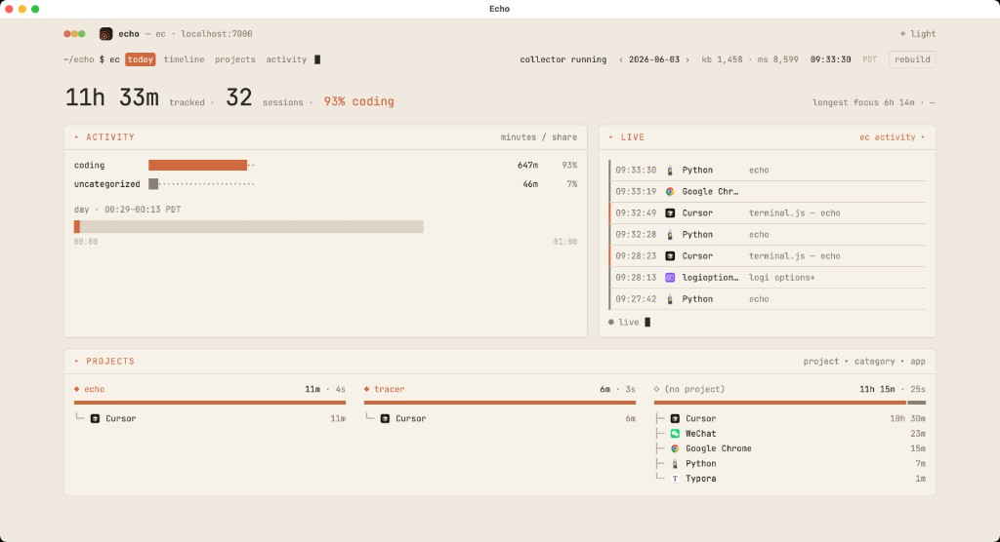

# Echo (MVP)



Echo is a local-first activity monitor. This MVP implements the week 1/2 core:

- metadata-only event ingest
- DuckDB storage
- sessionization
- rules-based categorization
- CLI reporting via `ec today`

Architecture-aligned module layout:

- `ec/layers/monitor/` - Sensors + collector boundary (monitor layer)
- `ec/layers/remember/` - DuckDB query facade (store/remember layer)
- `ec/layers/categorize/` - sessionize + retention facade (categorize layer)
- `ec/infrastructure/duckdb/` - DB schema, connection, models, collectors
- `ec/sensors/macos/` - macOS sensor implementations
- `ec/runtime/` - daemon, launchd integration, doctor checks
- `ec/app.py` - composition root wiring monitor/remember/categorize

## Quick start

1. Create and activate a virtual environment.
2. Install dependencies:

```bash
pip install -r requirements.txt
```

1. Capture one foreground-window sample (macOS):

```bash
python -m ec.main capture-once
```

1. Build sessions and labels:

```bash
python -m ec.main sessionize
```

1. View today's category breakdown:

```bash
python -m ec.main today
```

## Commands

- `capture-once` - captures active app + title and writes one event.
- `ingest-json <path>` - ingest newline-delimited JSON events.
- `sessionize` - derive sessions from raw events and apply rule labels.
- `today` - print today's active minutes grouped by category/app.
- `timeline [--date YYYY-MM-DD]` - print a session timeline.
- `retention [--days 90]` - drop old raw events.
- `start [--interval 10]` - run always-on capture loop in foreground.
- `start [--interval 10] [--capture-text]` - includes key/click counts; optional typed text capture.
- `stop` / `status` - stop or inspect the running collector process.
- `doctor` - check app directory, DB readiness, and sensor permission status.
- `launchd-install [--interval 10] [--load-now]` - write launch agent plist (and optionally load it).
- `raw [--last 20] [--text-chars 40] [--active-only] [--text-only] [--collapse] [--chronological]` - inspect recent raw events with filtering and collapse options.
- `tick` - run sessionization and print today's summary in one step.
- `log [--date YYYY-MM-DD] [--text-chars 120]` - full daily log (summary + sessions + collapsed activity).
- `follow [--interval 2] [--tail 20]` - stream new activity continuously (live tail).
- `desktop [--port 7000] [--browser]` - open the Echo dashboard in a native window (or browser).

## Desktop app

Launch the **ec:// terminal** dashboard (monospace UI, views: `today`, `timeline`, `projects`, `ask`, `activity`):

```bash
pip install -r requirements.txt
export ECHO_APP_DIR="$PWD/.echo-data"

python -m ec.main desktop
```

Design reference: `echo/design_handoff_ec_dashboard/`.

Options:

- `--browser` — open in Safari/Chrome instead of a native window
- `--no-window` — print the URL only (`http://127.0.0.1:7000`)
- `--port 7000` — change the local port

Run the collector in another terminal so live activity updates:

```bash
python -m ec.main start --interval 10 --capture-text
```

In the UI: **Rebuild sessions** (or `ec sessionize`) after collecting data; toggle **collector** and **live** in the header; switch theme with **☾ dark / ☀ light**.

### ASK (natural language)

The **ask** tab and the **ASK** box on **today** answer questions about your day. With a Moonshot key, Echo uses **Kimi K2.6** (`kimi-k2.6`). Without a key, local rule-based answers are used instead.

```bash
export MOONSHOT_API_KEY="sk-..."   # or ECHO_MOONSHOT_API_KEY — from platform.kimi.ai
# optional overrides:
# export ECHO_ASK_MODEL=kimi-k2.6
# export ECHO_LLM_BASE_URL=https://api.moonshot.ai/v1

# OpenAI still works if you set ECHO_ASK_MODEL=gpt-4o-mini and OPENAI_API_KEY

python -m ec.main desktop
```

## Daemon usage

Run continuous capture in one terminal:

```bash
python -m ec.main start --interval 10
```

In another terminal:

```bash
python -m ec.main status
python -m ec.main stop
```

## launchd setup

Write launch agent plist:

```bash
python -m ec.main launchd-install --interval 10
```

Write and load immediately:

```bash
python -m ec.main launchd-install --interval 10 --load-now
```

## Privacy defaults

- Keystrokes are counts only (`kb_count`) and never key content.
- URL data is reduced to `url_host`.
- Raw data stays local in DuckDB.

If you explicitly pass `--capture-text`, Echo also stores literal typed text for each interval in `raw_events.typed_text`. Keep this off unless you explicitly want it.
