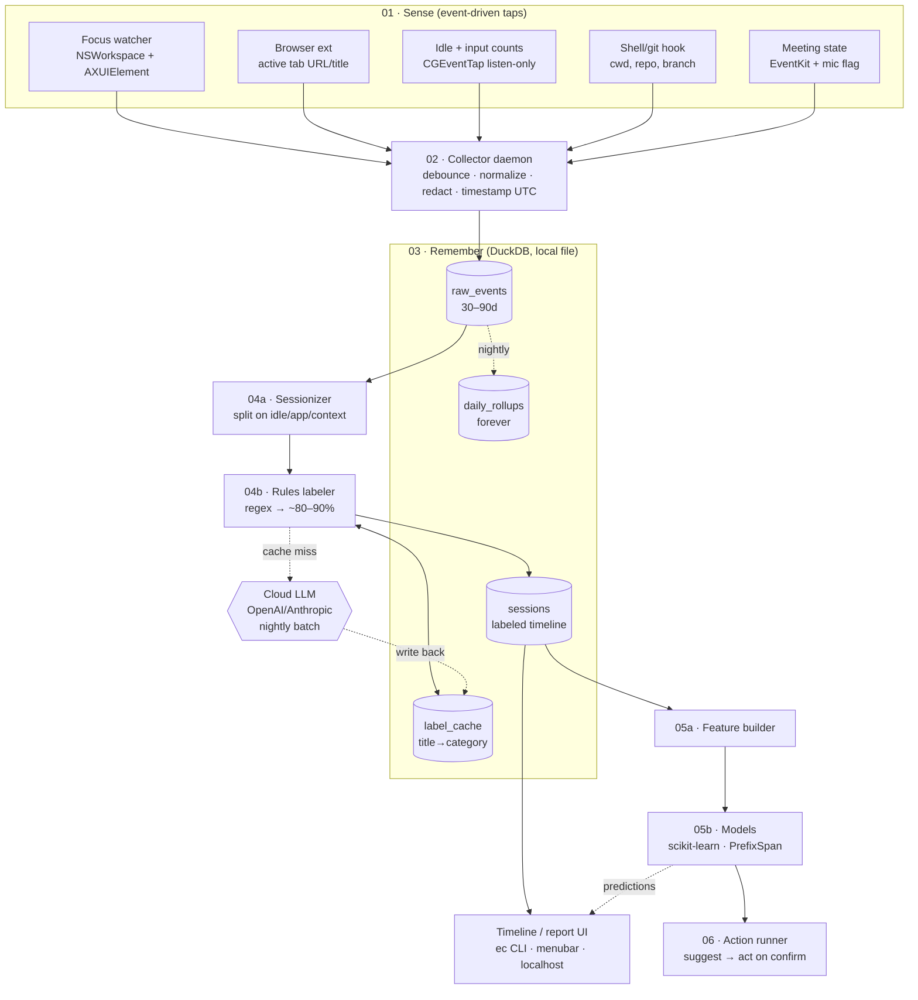

# Echo — Architecture (for Cursor)

A local-first macOS daemon that captures laptop activity, stores it, segments it into sessions, categorizes them, and learns to predict/automate workflows. Metadata-only: keystrokes are counted, never recorded; only normalized title text leaves the machine (nightly LLM labeling batch).

> Build target: macOS. Daemon + thin viewer. CLI binary is `ec` (the shell owns `echo`).

---

## System diagram



Edge legend: solid = sync/direct write, dotted = async/nightly batch.

---

## Layers

### 01 · Sense — sensors (event-driven, never poll)
Each sensor emits a small normalized record on change + a 5–15s heartbeat for the focused window.

| Sensor | macOS API | Emits |
|---|---|---|
| Focus watcher | `NSWorkspace.didActivateApplicationNotification` + `AXUIElement` for title | app bundle id, window title |
| Browser ext | WebExtension → native messaging host | active tab host + page title |
| Idle + input | `CGEventSource.secondsSinceLastEventType`; `CGEventTap` (listen-only) | idle bool, kb_count, mouse_count |
| Shell/git | zsh `precmd`/`preexec` hook | cwd, repo, branch, command class |
| Meeting | EventKit + CoreAudio mic-in-use | in_meeting bool |

Rules: `CGEventTap` only increments counters, never buffers key codes. Normalize titles (trim, lowercase host, strip query string) at the edge. First-run prompts: Accessibility + Input Monitoring.

### 02 · Collector — ingest daemon
One process. Drains the sensor queue, debounces focus churn (drop focuses < ~800ms), redacts (URL → host only, drop content), stamps `ts` UTC, appends to DuckDB. In-process queue (Go channel / `asyncio.Queue`); add a real broker only if you want a streaming story. Must be near-invisible on CPU/battery.

### 03 · Remember — DuckDB (single local file)
Path: `~/Library/Application Support/Echo/echo.duckdb`

**`raw_events`** (wide, append-only, 30–90d retention)
```
ts TIMESTAMP        -- UTC
app TEXT            -- bundle id
window_title TEXT   -- normalized, highest-signal
url_host TEXT       -- host only, never full path
repo TEXT
branch TEXT
idle BOOLEAN
kb_count INT        -- count, never keys
mouse_count INT
in_meeting BOOLEAN
source TEXT         -- which sensor
```

**`sessions`** (derived)
```
session_id TEXT PK
start_ts TIMESTAMP
end_ts TIMESTAMP
app TEXT
primary_title TEXT
repo TEXT
category TEXT       -- fixed enum
summary TEXT        -- one line, LLM or rule
label_source TEXT   -- 'rule' | 'llm' | 'cache'
kb_total INT
mouse_total INT
switch_count INT
```

**`daily_rollups`** (kept forever): per `(date, category, app)` → active_minutes, session_count, switch_count.

**`label_cache`**: `(title_norm TEXT PK, category TEXT, summary TEXT, source TEXT, decided_at TIMESTAMP)`

Nightly job deletes `raw_events` older than retention after rollups computed.

### 04 · Categorize

**04a Sessionizer.** Collapse raw events → sessions. Cut a new session when ANY of: idle gap > N min (default 5); foreground app changes; work-context changes within an app (repo change, URL host change, title distance over threshold). Merge sub-M-second flickers (M≈30) back to prior context. Make N and M config, not constants.

**04b Labeler — two tiers + cache.**
- Tier 1 rules (handles ~80–90%): `(app, title regex) → category`. Categories are a fixed enum: `Coding | Meeting | Comms | Research | Distraction | Other`.
  ```
  Xcode|iTerm|VS Code              → Coding
  Calendar | in_meeting=true       → Meeting
  Slack|Mail|Messages              → Comms
  Chrome+(docs|stackoverflow|arxiv)→ Research
  Chrome+(youtube|twitter|reddit)  → Distraction
  ```
- Tier 2 cloud LLM (the ~10–20% rules miss): nightly batch to OpenAI/Anthropic. Send ONLY `app + normalized title`. Get back `{category from enum, one-line summary}`. Cents/day.
- Cache: before calling LLM, look up `title_norm` in `label_cache`; on miss, call and write back. Calls trend to ~zero over weeks. LLM picks from the enum, never invents labels.

### 05 · Learn (after a few weeks of labeled data; all classical, local)
**Feature builder** per session: time-of-day bucket, day-of-week, weekend flag, previous-N session categories, current repo/app, recent switch rate, recent idle ratio.

**Models**
| Target | Method |
|---|---|
| Next-context | Markov chain or gradient-boosted classifier on transitions |
| Routine detection | sequential pattern mining (PrefixSpan) |
| Focus/anomaly alerts | rolling switch-rate threshold |

`scikit-learn` + `prefixspan`. No deep learning, no GPU, no serving.

### 06 · Act — action runner
Every automation gated behind confirmation until trusted. Examples: pre-open standup tabs at 9:45; auto-DND on detected deep work; draft end-of-day worklog from the timeline; "you usually do X now" nudge. **Hard rule:** suggest, then act on confirm — never fire unprompted on a noisy signal.

---

## Deployment / form factor
Not one app — a headless daemon + thin viewer.

| Piece | Form | Runs via |
|---|---|---|
| Collector daemon | headless | `launchd` user agent (`~/Library/LaunchAgents/*.plist`, `RunAtLoad`+`KeepAlive`) |
| Browser extension | WebExtension | native messaging host → daemon |
| Nightly jobs (rollups, retention, LLM) | scripts | `launchd` `StartCalendarInterval` or daemon timer |
| Viewer | CLI → menubar → localhost web | see below |

Viewer, cheapest first: (1) CLI `ec today` — week 1, zero UI; (2) menubar app (`MenuBarExtra` / `rumps`) — natural home, also where action confirmations live; (3) `localhost:7000` web page — richest charts. Likely end state: launchd daemon + browser extension + menubar app. Package daemon+menubar as one signed `.app` that installs the launch agent on first run.

---

## Stack
| Layer | Choice |
|---|---|
| Sensor daemon | Swift (clean native APIs) or Python + `pyobjc` |
| Browser | WebExtension + native messaging host |
| Bus | in-process queue (broker optional) |
| Store | DuckDB |
| Rules | regex table in config |
| LLM labeler | OpenAI/Anthropic API, nightly batch |
| Models | scikit-learn + `prefixspan` |
| UI | `ec` CLI + menubar + optional localhost web |

---

## Build order
1. **Week 1:** Focus watcher → DuckDB → `ec today` CLI. Proves the pipeline end to end.
2. **Week 2:** Sessionizer + rules labels + daily timeline view. Usable product.
3. **Week 3+:** Nightly cloud-LLM pass + cache for rules-miss sessions.
4. **Later:** Feature builder + transition model + first single automation (worklog draft).

## Invariants (enforce everywhere)
- Metadata, never content. Keystrokes counted, never recorded. URLs → host only.
- Raw events never leave the machine; only `app + normalized title` goes to the LLM, only on cache miss.
- Event-driven, not polling. Daemon must be near-invisible.
- Suggest, then act on confirm.
